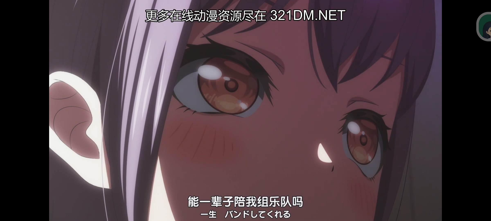
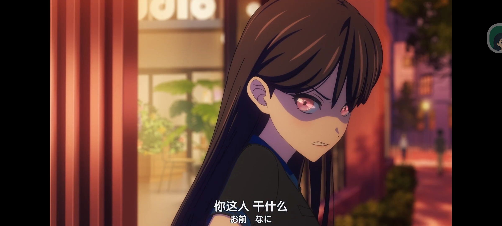
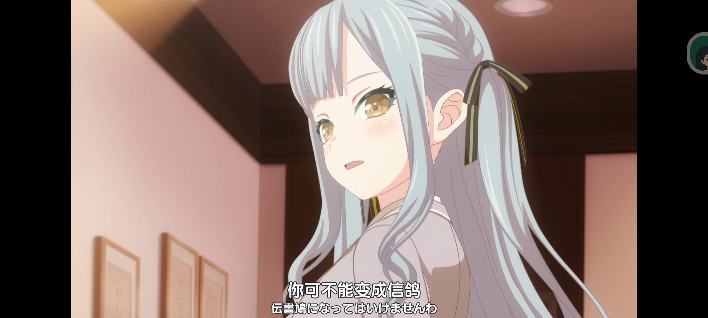
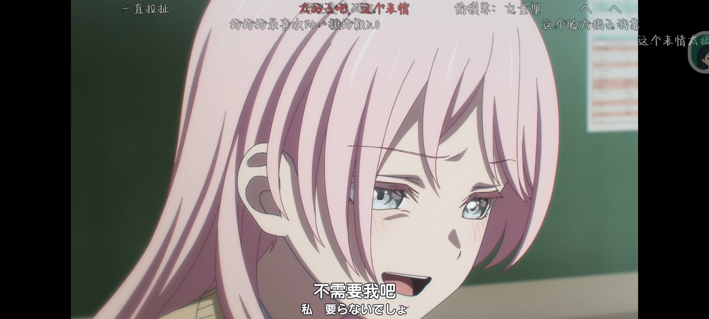
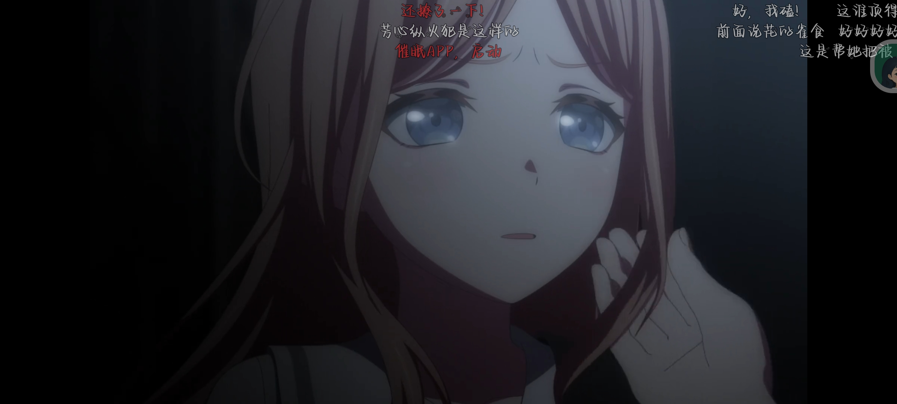
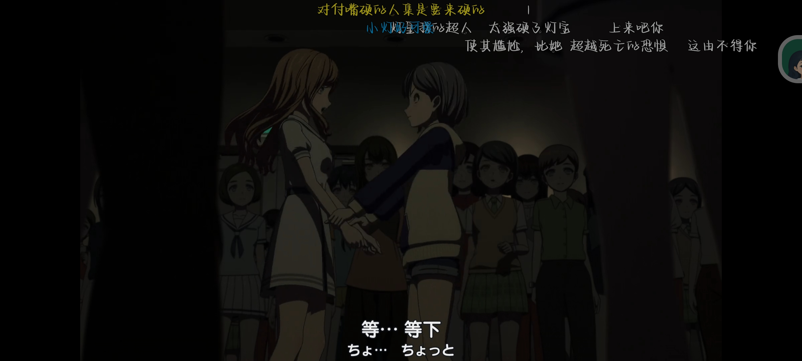

## Bang Dream It's MyGO

* 评分: 85
* 标签: 百合 乐队 扭曲 沉重
* [BanG Dream!/TV动画化作品/MyGO!!!!! - 萌娘百科](https://mzh.moegirl.org.cn/BanG_Dream!/TV%E5%8A%A8%E7%94%BB%E5%8C%96%E4%BD%9C%E5%93%81#TV%E5%8A%A8%E7%94%BB%E3%80%8ABanG_Dream!_It's_MyGO!!!!!%E3%80%8B)

### 番评

第一次看邦，对比同期以细腻称霸的刺刺(GBC)来说，mygo里面的乐队成员缺乏沟通，大部分人都有自己独特的扭曲的过去.故事从CryChic解散开始，到各成员开始沟通理解，最终形成了两个乐队 Mygo 和 Ave Mujica.

我觉得很好看，但是情感细腻程度不如刺刺，并且我被刀的有点那个了所以我给了85，总体上十分优秀。

### 截图

名场面一览:

#### 剩下的去 [文件夹](static/) 里看吧
