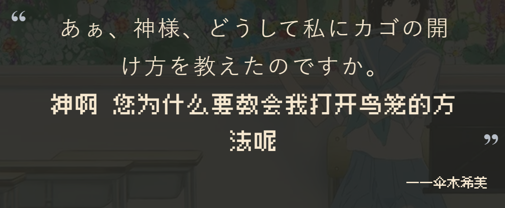
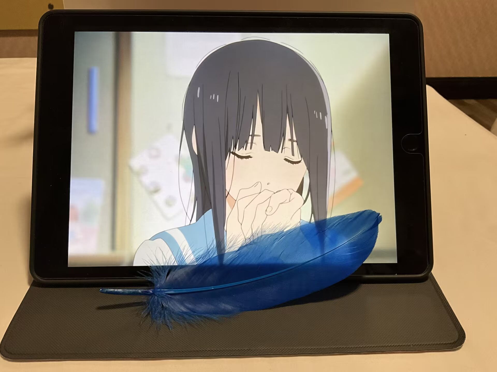
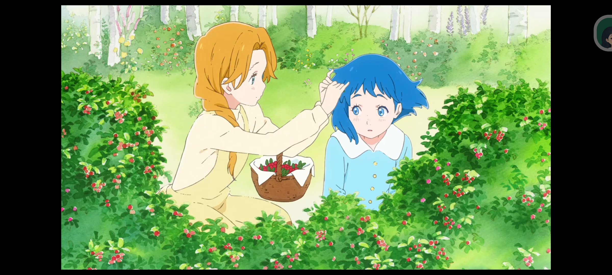
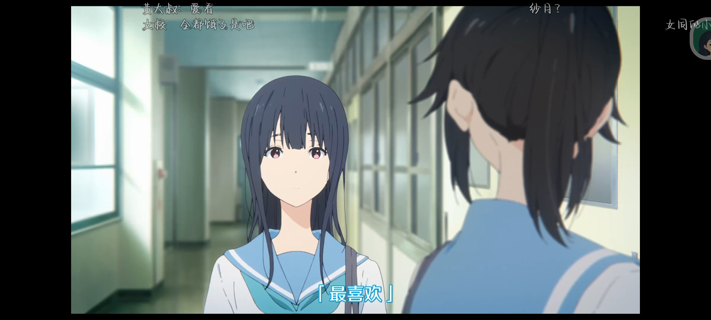
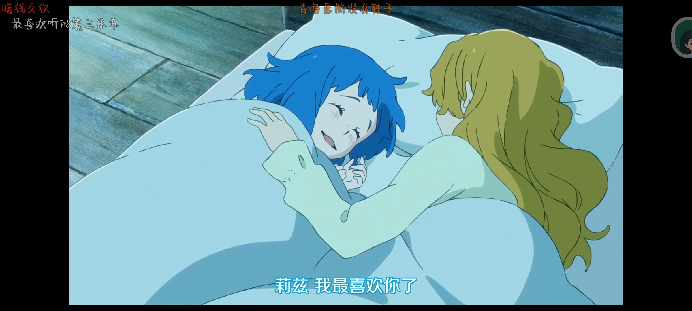

## 利兹与青鸟

* 评分: 98
* 标签: 百合 校园 音乐 艺术
* link: [莉兹与青鸟 - 萌娘百科](https://mzh.moegirl.org.cn/%E8%8E%89%E5%85%B9%E4%B8%8E%E9%9D%92%E9%B8%9F)

## 番评

    互为利兹与青鸟的两个人:[铠冢霙](https://mzh.moegirl.org.cn/%E9%93%A0%E5%86%A2%E9%9C%99 "铠冢霙") (英) 和 [伞木希美](https://mzh.moegirl.org.cn/%E4%BC%9E%E6%9C%A8%E5%B8%8C%E7%BE%8E "伞木希美") (伞哥) ，相互分别的故事

    "如果我是利兹，我一定会把青鸟锁在笼子里."

    “以成全最爱的人的愿望，展现自己的爱意。”

非常细腻的一部番，以利兹与青鸟故事与演奏为线索，开始慢描二人情感。利兹不想束缚青鸟，放走了她。青鸟因为太爱利兹，只能成全利兹的心愿。

